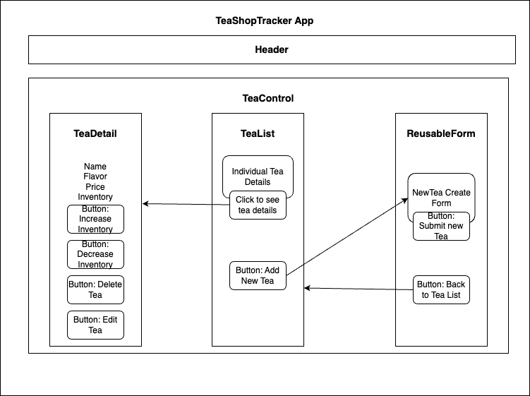

# _Tea Shop Inventory Tracker Web Application_

#### By _**Jessica Hattig**_

#### _Epicodus, Week 31-32 Independent Project: React Fundamentals_

## Description
Welcome to the Tea Shop Tracker, a delightful project that helps you manage your tea shop inventory with ease. This intuitive web application allows tea shop owners to add, edit, and track various tea blends, keeping tabs on their names, flavors, prices, and inventory. With a user-friendly interface, you can seamlessly navigate through your tea list, update inventory, and even edit tea details. The Tea Shop Tracker is the perfect application for tea enthusiasts and shop owners, ensuring a well-organized and enjoyable tea-selling experience.

## Technologies Used
- React
- JavaScript
- PropTypes
- Node Package Manager (NPM)
- HTML / CSS
- Git

## Component Tree
```
├── App.js
├── Header.js
├── TeaControl.js
│   ├── NewTeaForm.js
│   ├── ReusableForm.js
│   ├── TeaList.js
│   │   └── Tea.js
│   └── TeaDetail.js
│       └── EditTeaForm.js
└── img
    └── tea.png 
```
## Component Diagram


## Setup/Installation Requirements
1. Clone project `$ git clone https://github.com/jessicahattig/TeaShopTracker.git`
2. Navigate to project directory called `$ cd tea-shop-tracker`. 
3. Install dependencies `npm install`.
4. Start application `npm run start` on server `localhost:3000`.

## Known Bugs
- Please visit this projects [GitHub repository]() to submit Issues and Pull Requests.

## License
MIT License

Permission is hereby granted, free of charge, to any person obtaining a copy of this software and associated documentation files (the “Software”), to deal in the Software without restriction, including without limitation the rights to use, copy, modify, merge, publish, distribute, sublicense, and/or sell copies of the Software, and to permit persons to whom the Software is furnished to do so, subject to the following conditions:

The above copyright notice and this permission notice shall be included in all copies or substantial portions of the Software.

THE SOFTWARE IS PROVIDED “AS IS”, WITHOUT WARRANTY OF ANY KIND, EXPRESS OR IMPLIED, INCLUDING BUT NOT LIMITED TO THE WARRANTIES OF MERCHANTABILITY, FITNESS FOR A PARTICULAR PURPOSE AND NONINFRINGEMENT. IN NO EVENT SHALL THE AUTHORS OR COPYRIGHT HOLDERS BE LIABLE FOR ANY CLAIM, DAMAGES OR OTHER LIABILITY, WHETHER IN AN ACTION OF CONTRACT, TORT OR OTHERWISE, ARISING FROM, OUT OF OR IN CONNECTION WITH THE SOFTWARE OR THE USE OR OTHER DEALINGS IN THE SOFTWARE.

Copyright (c) Jessica Hattig 2024